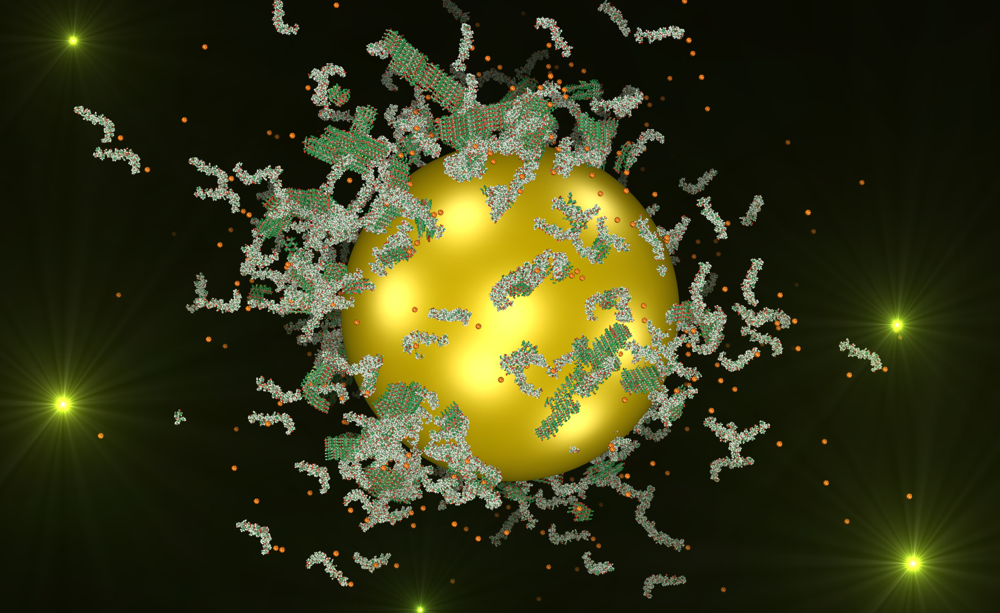
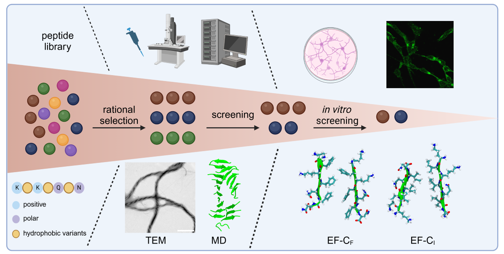
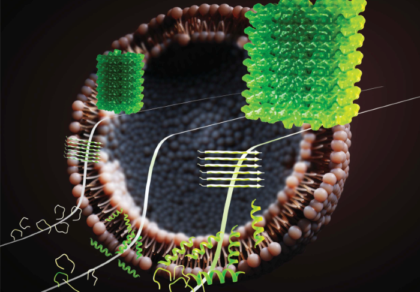

### Research Vision
Our long-term goal is to establish predictive design principles that connect peptide sequence, environment, and interface chemistry to self-assembly pathways and biological function. By integrating biophysical experiments with molecular dynamics simulations, we aim to bridge fundamental mechanisms of peptide aggregation, membrane activity, and interface interactions with disease-relevant insight and the rational design of functional biomolecular systems.

### Methods and Expertise
- _Experimental_: QCM-D, fluorescence spectroscopy, DLS, UV-vis spectroscopy, CD spectroscopy, kinetic aggregation assays, model membrane systems and liposomes
- _Computational_: All-atom and coarse-grained molecular dynamics simulations

---

### Interface-Controlled Peptide Self-Assembly

We investigate how biological and synthetic interfaces direct and modulate peptide self-assembly pathways. Interfaces such as nanoparticles, inorganic surfaces, and soft matter systems actively influence nucleation, fibril growth, and higher-order organisation of amyloid-forming peptides. Using spectroscopy, surface-sensitive techniques including QCM-D, and molecular dynamics simulations, we study how interfacial properties (curvature, charge, and chemical functionality) control peptide adsorption, corona formation, and aggregation pathways. These studies are directly relevant to understanding aggregation processes associated with neurodegenerative diseases and provide a mechanistic foundation for controlling self-assembly at the nanoscale.

**Selected Publications**

Torsten John et al. (2024). Molecular Insights into the Dynamics of Amyloid Fibril Growth. *ACS Chem. Neurosci.* [DOI](https://doi.org/10.1021/acschemneuro.3c00754)

Torsten John et al. (2022). Mechanistic insights into nanoparticle effects on amyloid fibril formation. *J. Colloid Interface Sci.* [DOI](https://doi.org/10.1016/j.jcis.2022.04.134)

Torsten John, Anika Gladytz et al. (2018). Impact of nanoparticles on amyloid peptide and protein aggregation: a review with a focus on gold nanoparticles. *Nanoscale*. [DOI](https://doi.org/10.1039/C8NR04506B)

---

### Sequence-Guided Design of Functional Peptide Fibrils

We decode how peptide sequence encodes fibril structure, polymorphism, and function. Using molecular dynamics simulations, kinetic aggregation assays, and biophysical characterisation, we establish sequence–structure–function relationships for amyloid(-like) fibrils with defined morphology and emergent properties. Building on this mechanistic understanding, we engineer functional bionanomaterials, including peptide fibrils and hybrid systems combining peptides with nucleic acids, for applications in catalysis, neural regeneration, viral particle concentration, and modulation of cell-material interactions.

**Selected Publications**

Albin Lahu et al. (2026). Co-Assemblies Regulate the Catalytic Activity of Peptide Fibrils. *Angew. Chem. Int. Ed.* [DOI](https://doi.org/10.1002/anie.202511165)

Yu-Liang Tsai et al. (2025). Design of the Hydrophobic Core of Self-Assembling Peptide Fibrils. *Small Sci.* [DOI](https://doi.org/10.1002/smsc.202500224)

Manuel Hayn, Torsten John et al. (2024). Hybrid Materials From Peptide Nanofibrils and Magnetic Beads to Concentrate and Isolate Virus Particles. *Advanced Functional Materials*. [DOI](https://doi.org/10.1002/adfm.202316260)

---

### Membrane Activity of Self-Assembling and Antimicrobial Peptides

We investigate how self-assembling and antimicrobial peptides interact with lipid membranes. Membranes play an active role in modulating peptide structure and function, and conversely, peptides can disrupt, remodel, or selectively permeabilise membranes depending on their sequence, aggregation state, and the membrane environment. Using model membrane systems, liposomes, QCM-D, fluorescence spectroscopy, and molecular dynamics simulations, we explore how membrane composition, lipid oxidation, and peptide self-assembly govern membrane activity and antimicrobial selectivity.

**Selected Publications**

Torsten John et al. (2023). Lipid oxidation controls peptide self-assembly near membranes. *Chem. Sci.* [DOI](https://doi.org/10.1039/D3SC00159H)

Torsten John et al. (2019). The Kinetics of Amyloid Fibrillar Aggregation of Uperin 3.5 Is Directed by the Peptide's Secondary Structure. *Biochemistry*. [DOI](https://doi.org/10.1021/acs.biochem.9b00536)